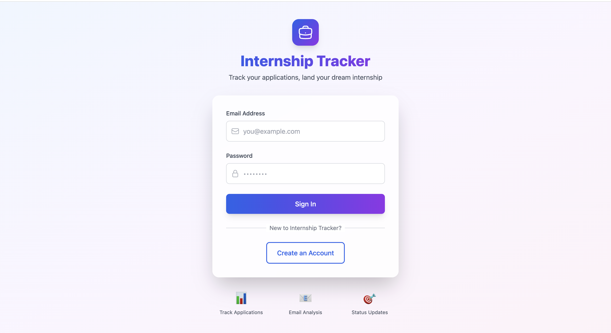
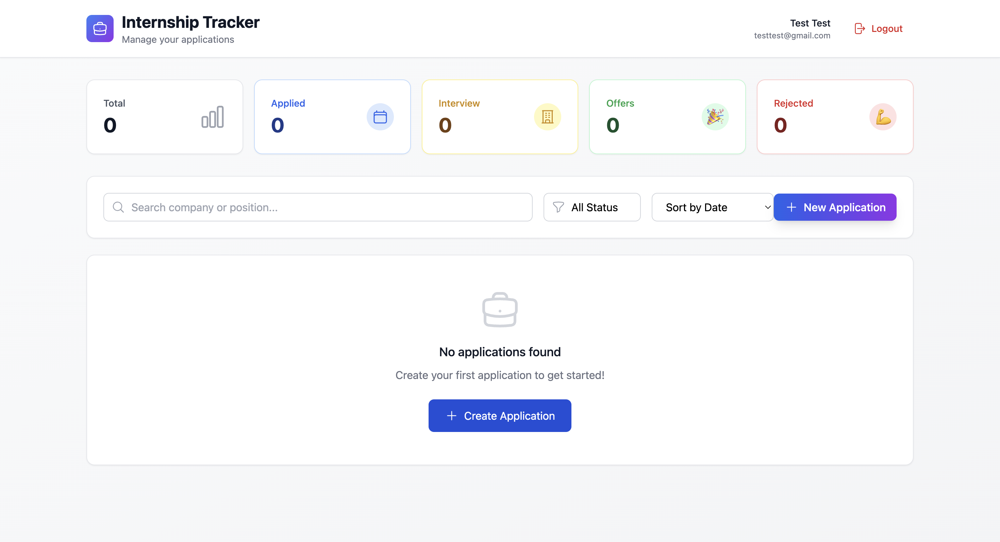
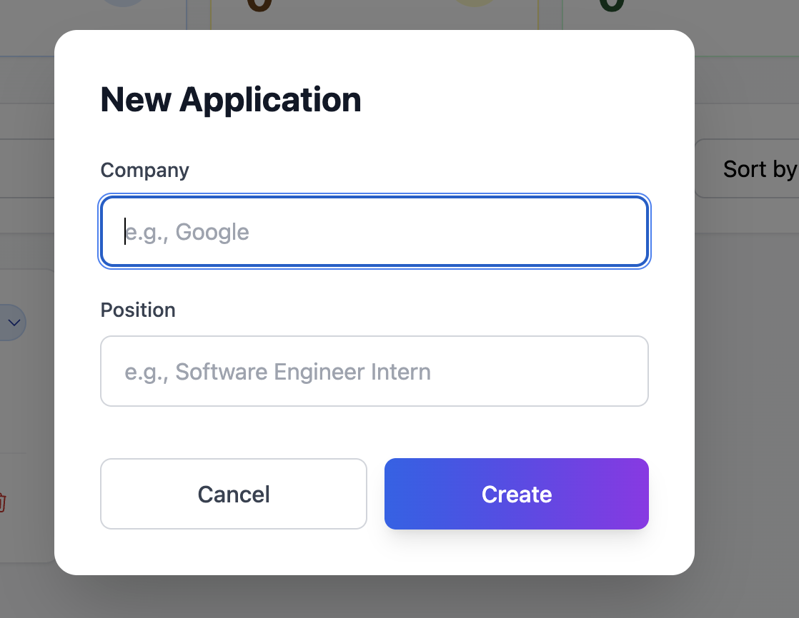
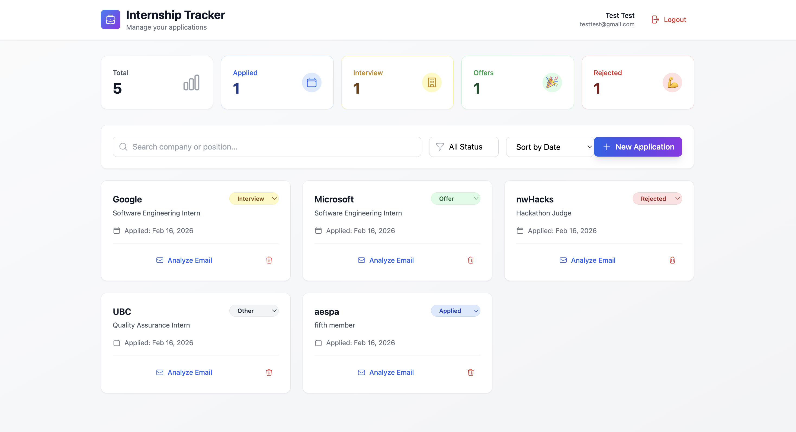
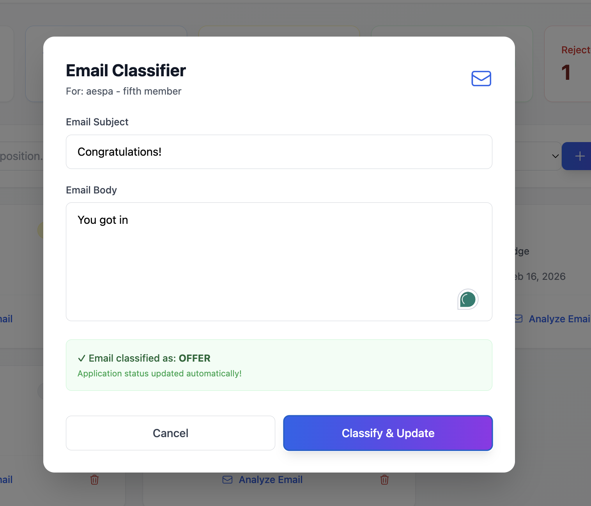

# MyInternship

MyInternship is a full-stack web app that helps students track internship applications in one place, manage status changes, and stay organized during recruiting.

## Live Deployment
- Frontend (Vercel): [https://internship-tracker-frontend-nu.vercel.app](https://internship-tracker-frontend-nu.vercel.app)
- Backend (Render): [https://internship-tracker-xo8m.onrender.com](https://internship-tracker-xo8m.onrender.com)
- API Health: [https://internship-tracker-xo8m.onrender.com/api/health](https://internship-tracker-xo8m.onrender.com/api/health)

## Product Preview 

### Signup Page

### Login Page

### Dashboard (no applications)

### Create Application

### Dashboard (with applications)

### Email Classification

## Components
- Link to backend source code: [https://github.com/ansonnchan/internship-tracker-backend](https://github.com/ansonnchan/internship-tracker-backend)
- Link to frontend source code: [https://github.com/ansonnchan/internship-tracker-frontend](https://github.com/ansonnchan/internship-tracker-frontend)
  
## Tech Stack
- Backend: Java + Spring Boot
- API style: REST API
- Database: PostgreSQL (for persistent data management)
- Frontend: TypeScript, JavaScript, CSS (Next.js/React app)
- Deployment: Render (backend) + Vercel (frontend)

## What It Does
- User signup/login with JWT-based authentication
- Create, view, update, and delete internship applications
- Track application statuses (Applied, Interview, Offer, Rejected, Other)
- Email-status classification flow to help update applications faster

## Architecture Overview
- Frontend UI sends requests to the Spring Boot REST API
- Backend handles auth, validation, business logic, and data access
- PostgreSQL stores user/application data persistently

## Future Improvements
- Integrate Gmail API so the app can directly read/crawl relevant recruiting emails
- Replace hardcoded email classification logic with NLP or an LLM API for smarter, more flexible classification
- Create a delete account button
- Architect a system to verify email addresses
